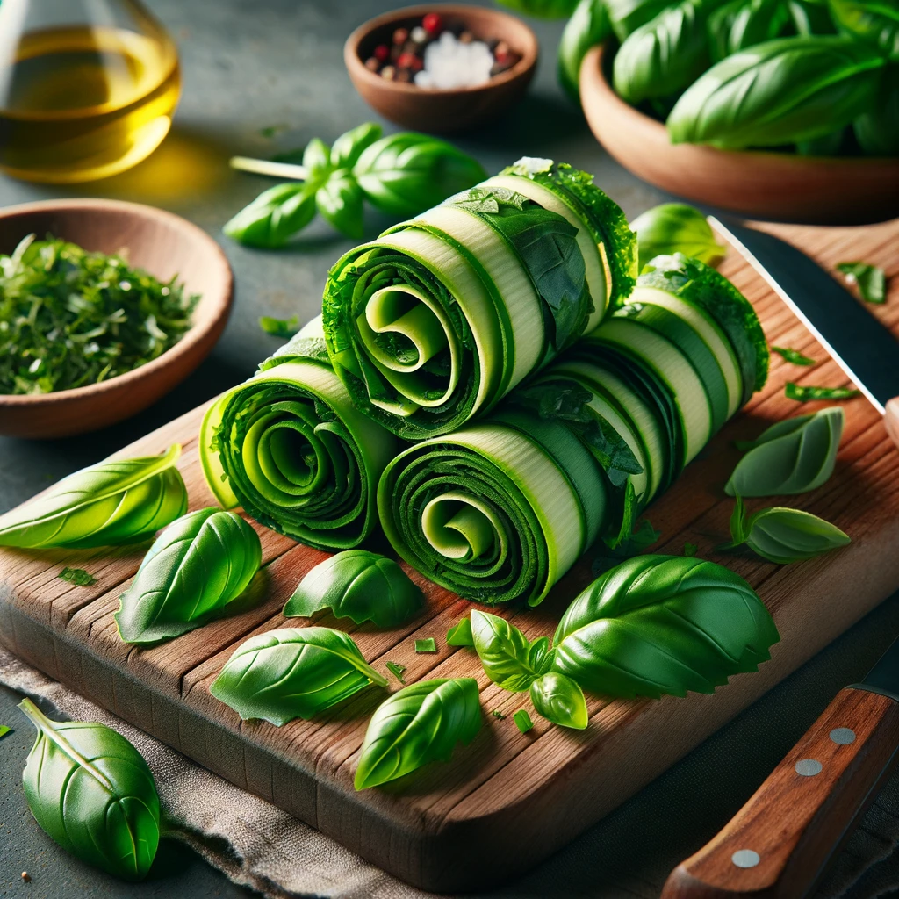
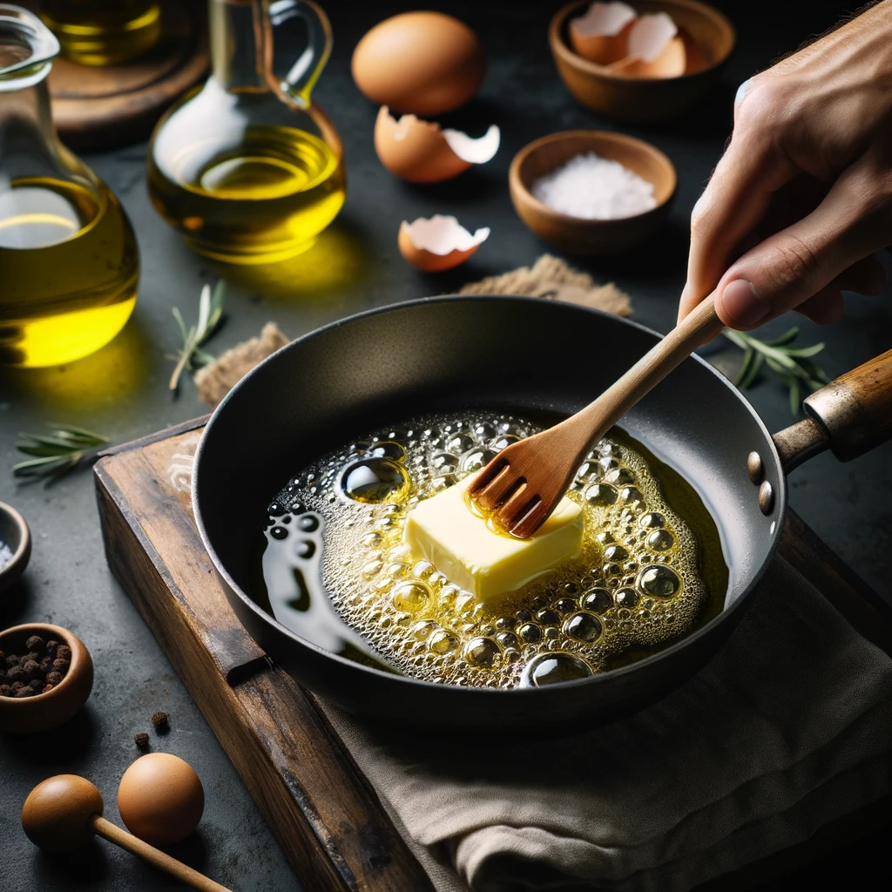
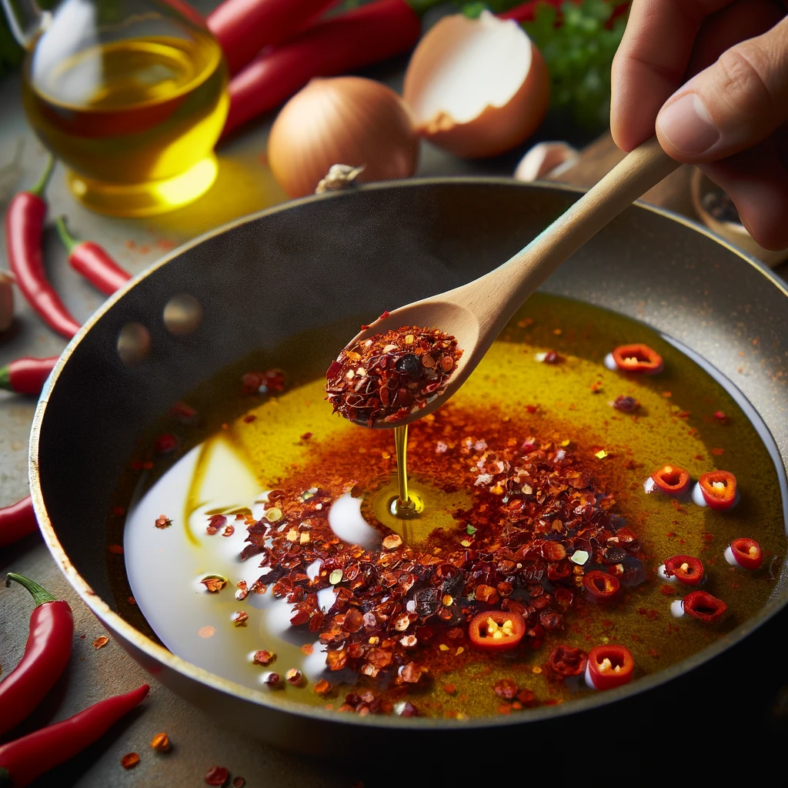
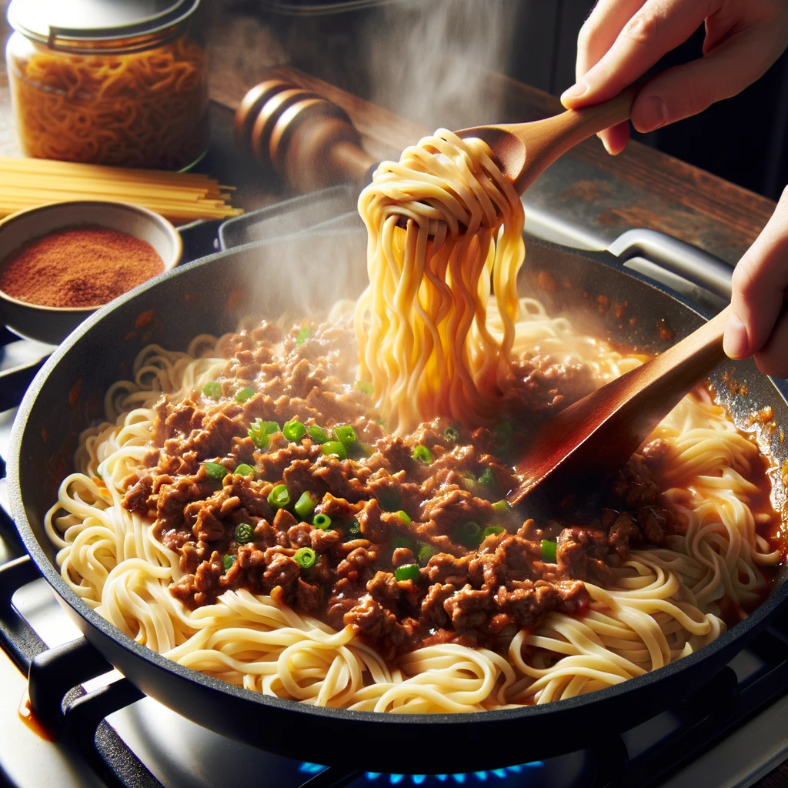
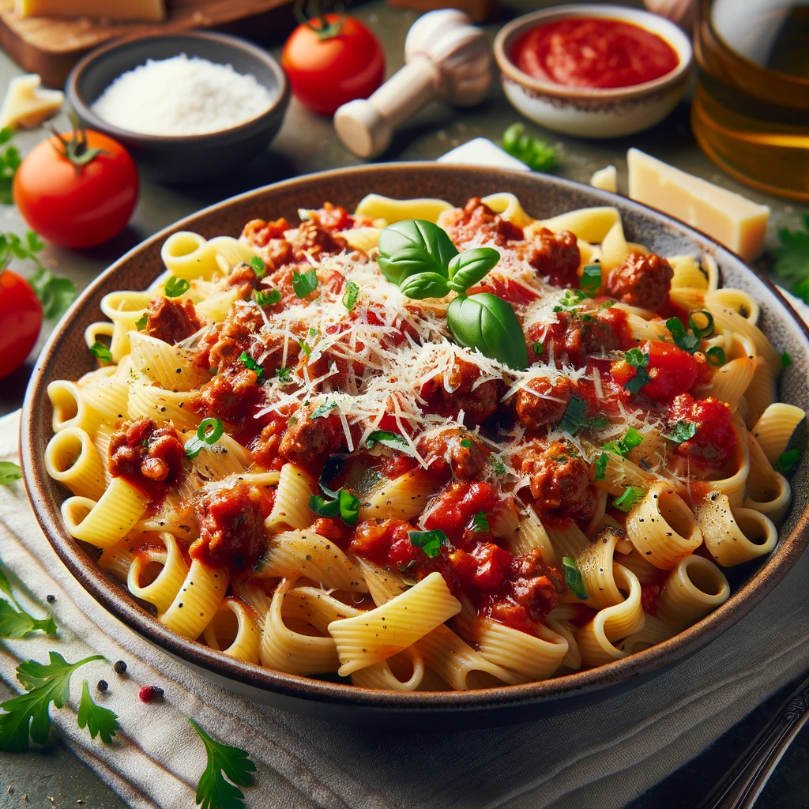

# Basic Pasta

## Prerequisites

- Your favorite sauce or [Bolognese](../sauces/Bolognese.md)

## Ingredients

- Pasta noodles
- Basil and parsley leaves
- Butter
- Olive oil
- Crushed red pepper
- Fresh garlic slices
- Meat sauce (See Prerequisites)
- Shredded Parmesan cheese

### Instructions

1. **Cook the Noodles:** Follow the package instructions to cook the pasta noodles. If you're making fresh noodles, prepare them accordingly.

2. **Prepare Herb Ribbons:** Roll basil and parsley leaves into a tight roll and slice them into thin ribbons.

   </img>

3. **Heat the Pan:** Place a small nub of butter and a little bit of olive oil in a pan and heat it up.

   </img>

4. **Add Crushed Red Pepper:** Add crushed red pepper to the heated oil and sauté until the oil gains a tint of red.

   > Only add enough red pepper to your preference. This AI image amount of red pepper is insane!

   </img>

5. **Sauté Garlic:** Add fresh garlic slices to the pan and sauté until fragrant.

6. **Add Meat Sauce:** Add one or two ladles of the prepared meat sauce to the pan and heat until hot.

7. **Combine with Noodles:** Add the cooked noodles to the pan. Crank up the heat to cook down any water brought in with the noodles.

   </img>

8. **Finish with Cheese and Herbs:** Turn off the heat and add shredded Parmesan cheese. Stir in the fresh herb ribbons.

   </img>

9. **Serve:** Your pasta dish is ready to be served. Enjoy the rich flavors and fresh herbs in every bite!

This pasta dish perfectly combines the rich meat sauce with fresh herbs and a hint of spice, making for a delightful and satisfying meal.
