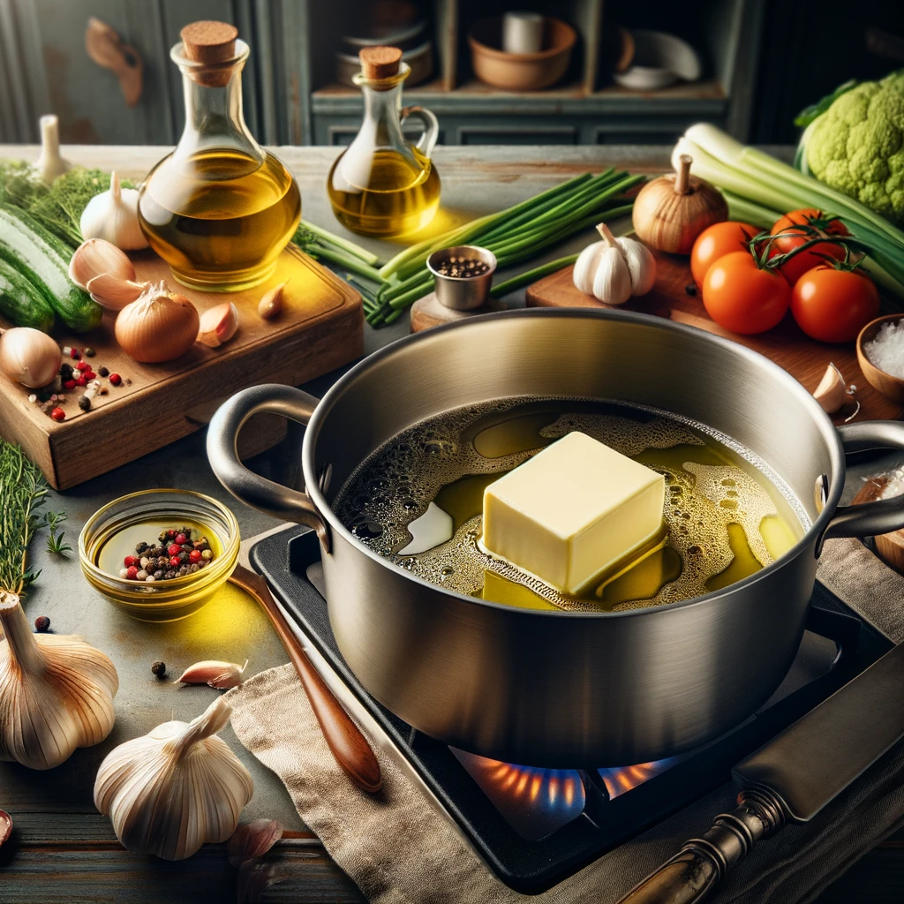
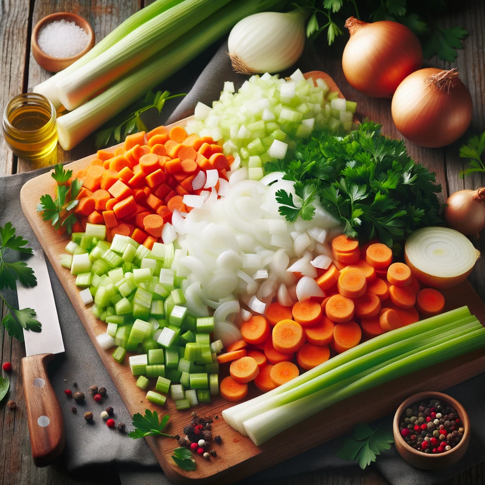
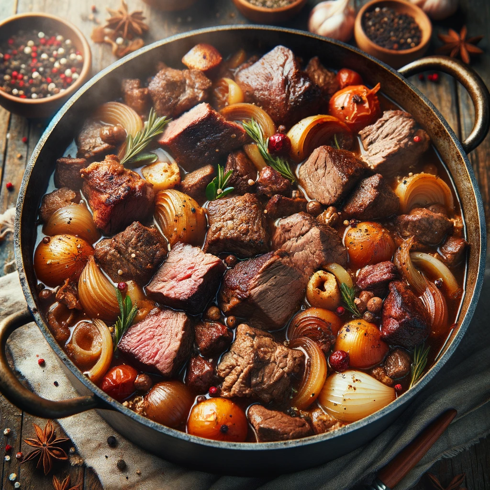
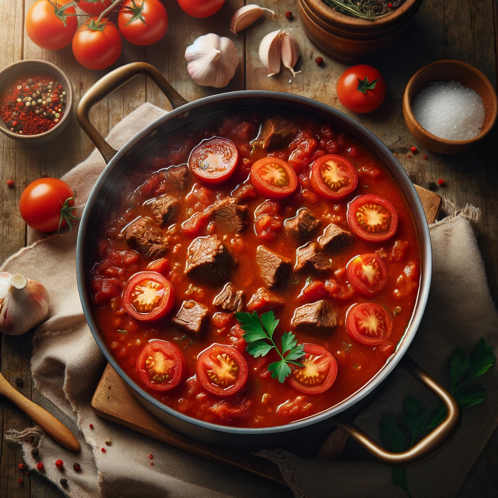
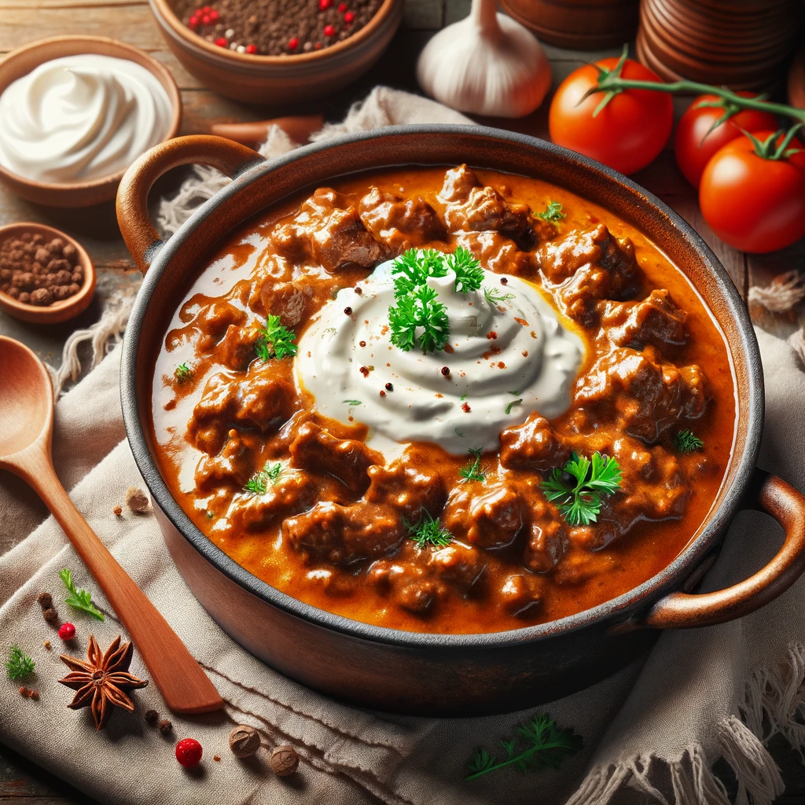

# Bolognese Sauce

Source: [Bolognese Sauce | Kitchen on the Cliff with Giovanna Bellia LaMarca](https://www.youtube.com/watch?v=Ze2YhU8rGjY&t)

## Ingredients

- 1/4 cup butter
- 1/4 cup extra virgin olive oil
- 1 onion, chopped
- 1 carrot, chopped
- 1 stalk celery, chopped
- 1 1/2 lbs mixed beef, veal, and pork, chopped
- 1 cup white wine
- 28 oz can whole Italian peeled tomatoes, pureed
- 2 cups beef broth
- Salt & freshly grated nutmeg, to taste
- 1 cup heavy cream

## Instructions

1. **Prepare the Pot:** Heat butter and olive oil in a large pot over medium heat.

   <!--  -->

   </img>

2. **Chop Vegetables:** Finely chop the onion, carrot, and celery.

   <!--  -->

   </img>

3. **Cook Vegetables:** Add the chopped vegetables to the pot and cook until they begin to soften.

4. **Brown the Meat:** Add the mixed meats to the pot and brown them, stirring frequently.

   <!--  -->

   </img>

5. **Deglaze with Wine:** Pour in the wine and cook for a few minutes to allow the alcohol to evaporate.

6. **Add Tomatoes and Broth:** Stir in the pureed tomatoes and beef broth, then bring to a boil. Reduce heat to a simmer.

   <!--  -->

   </img>

7. **Season:** Add salt and nutmeg to taste.

8. **Simmer:** Cover and simmer for about 90 minutes, until the sauce thickens.

9. **Finish with Cream:** Stir in the heavy cream and cook for a few more minutes.

   <!--  -->

   </img>

10. **Serve:** Your rich and creamy meat sauce is ready to be served with your favorite pasta, lasagna, or as a bread topping.

Enjoy your meal!
